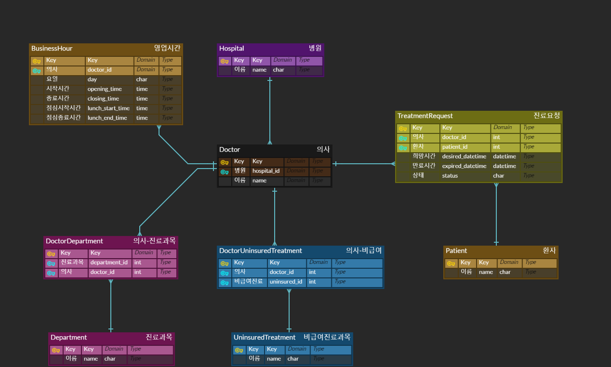
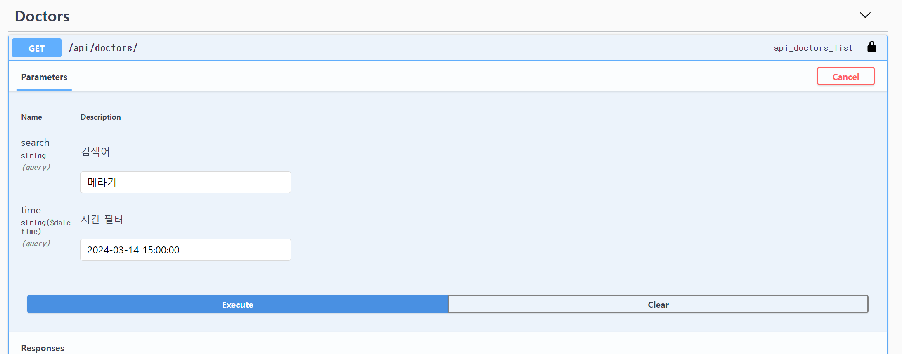
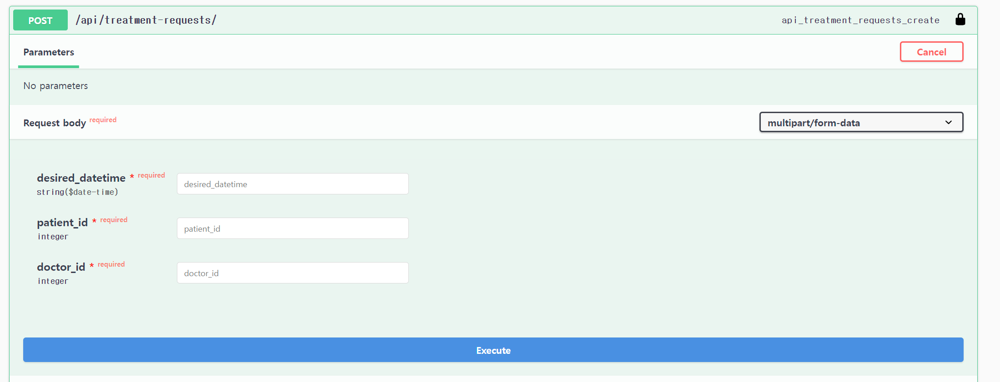
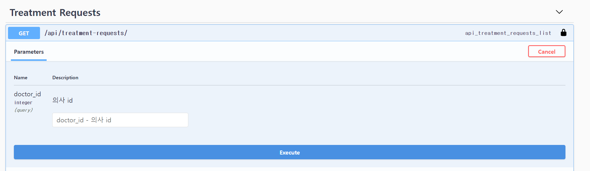
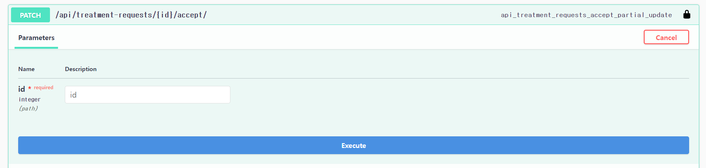

# My Hospital

### ERD



## 1. 프로젝트 세팅 방법
### 가상환경 실행
```
python -m venv venv
source venv/bin/activate (윈도우의 경우  ./venv/Scripts/activate)
```
### requirements 설치
```
pip3 install -r requirements.txt
```
### 더미 데이터 생성(이미 생성된 상태입니다.)
```
cd app
python manage.py migrate
python manage.py create_dummy
```
### runserver
```
python manage.py runserver
```

이후 ```http://localhost:8000/api/swagger/```에 접속하여 확인하실 수 있습니다.
## 2. 데이터 입력 방법
생성된 모든 모델은 각 모델의 이름으로 swagger에서 POST 요청을 보낼 수 있게 만들었습니다.
다만 테스트 코드로 동작은 확인하였으나, swagger에서 List 형태로 보내는 부분은(Doctor 모델만 해당합니다.)'application/json' 형태로만 가능합니다.
```
# Doctor 테스트 데이터 예시
{
    'name': '테스트의사',
    'hospital_id': 1,
    'department_ids': [1, 2, 3],
    'treatment_ids': [1]
}


```

## 3. 각 로직 실행 방법

각 로직들은 테스트 코드로 테스트했습니다.
테스트 코드는 /app 경로에서 ```pytest``` 명령어를 입력하여 실행합니다.

```
/app> pytest -s
```

### 1. 의사 검색
테스트 코드: app/clinic/tests/test_doctor.py -  test_search_doctor_with_string


  | Method | URL          | 쿼리 파라미터                               |
  | ------ | ------------ | ------------------------------------------- |
  | GET    | /api/doctors | search="메라키", time="2024-03-14 15:00:00" |



### 2. 진료 요청
테스트 코드: app/clinic/tests/test_treatment.py - test_post_treatment_requests

  | Method | URL                      | 데이터                                                        |
  | ------ | ------------------------ | ------------------------------------------------------------- |
  | POST   | /api/treatment-requests/ | doctor_id=1, patient_id=1, desired_datetime="2024-03-14 15:00 |



### 3. 진료 요청 검색
테스트 코드: app/clinic/tests/test_treatment.py - test_get_treatment_requests_by_doctor_id

  | Method | URL                      | 쿼리 파라미터 |
  | ------ | ------------------------ | ------------- |
  | GET    | /api/treatment-requests/ | doctor_id=1   |



### 4. 진료 요청 수락
테스트 코드: app/clinic/tests/test_treatment.py - test_accept_treatment_request

  | Method | URL                                                              |
  | ------ | ---------------------------------------------------------------- |
  | PATCH  | /api/treatment-requests/<```int:treatment_request_id```><accept> |


